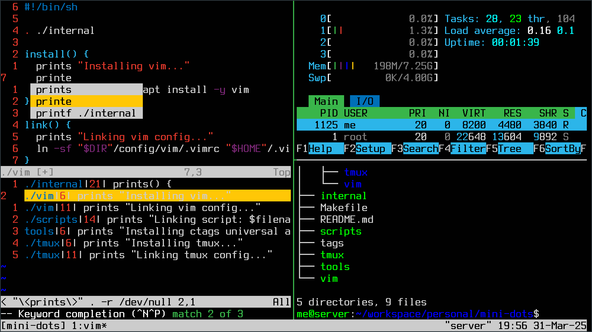

# Mini Dots

**The Minimalist CLI Development Environment**

## Text Editor

**Vim** without plugins, providing features like:

- File navigation (with **Netrw**) and search (with **wildmenu**)
- Code navigation (with **ctags** and **grep**)
- Further easing navigation with **marks** and the **quickfix list**
- Built-in auto-completion (enhanced with **ctags**)

## Screen Management

**Tmux** for:

- Managing screen space
- Managing multiple sessions
- With **vi bindings**

## Automation

- **POSIX** compliant shell scripts
- Structured with functions
- Organized in a **Makefile**

## Bonus

It looks great on **tty** as well!

